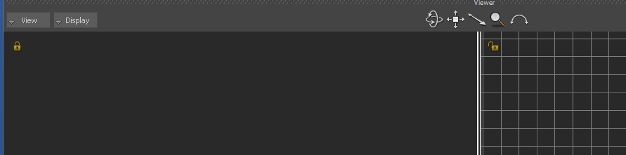

# Lock Camera Manipulator

The plugin draws a small 'locker' button in the upper left corner of each viewer pane. It is a toggle button that controls whether the user can change the camera in the pane or if the camera should be locked to the current one.



### Configuration

You can tweak icon offset, size and file path to the icon lock/unlock images in the configuration file

\<Documents>\MB\\\<version>\config\\\<pc name>.LockPaneCamera.txt

Example of configuration:

```
[Common]
OffsetX = 10.00 ; Offset from the pane border
OffsetY = 10.00 ; Offset from the pane border
SizeX = 20.00 ; Offset from the pane border
SizeY = 20.00 ; Offset from the pane border
Alpha = 0.80 ; Rect transparency
Lock Image Path = \\system\\CharacterizationTool\\icons\\ToolBar_Lock.png ; image for the lock state, relative to mobu bin
UnLock Image Path = \\system\\CharacterizationTool\\icons\\ToolBar_UnLock.png ; image for the unlock state, relative to mobu bin

```
