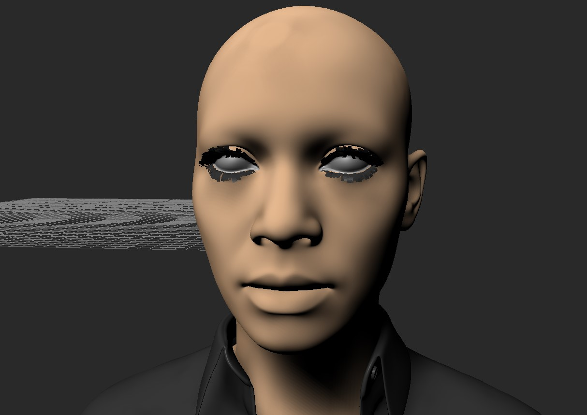

# Post Processing Effects

The plugin that applies post effects in your viewport window 

## Effects

Here is an original test scene, that I'm going to apply build-in effects one by one

<figure><figcaption></figcaption></figure>

| Effect                                | image                                                                 | Description                                                                                                                                                             |
| ------------------------------------- | --------------------------------------------------------------------- | ----------------------------------------------------------------------------------------------------------------------------------------------------------------------- |
| Color Correction                      |  | <ul><li>Tweak image contrast, brightness, gamma </li><li>Invert the image colors</li><li>Hue and saturation</li><li>Chromatic abberation</li><li>Bloom effect</li></ul> |
| Displacement                          |     | an animated wave distortion effect                                                                                                                                      |
| Depth of Field (DOF)                  |              | A depth of field effect                                                                                                                                                 |
| Film Grain                            |        | Animated film grain effect                                                                                                                                              |
| Fish Eye                              |          | Fish eye distortion of the image                                                                                                                                        |
| Lens Flare                            |        | Lens flare with a possibility to connect 3d scene lights as a source position for the effect. There is an additional feature of 3d occlusion for the effect.            |
| Motion Blur (Camera)                  |       | Based on previous and current camera transforms, blur based on a camera movement                                                                                        |
| Screen Space Ambient Occlusion (SSAO) |             | micro shadowing                                                                                                                                                         |
| Vignetting                            |        | a vignetting effect                                                                                                                                                     |


[custom-effect.md](custom-effect.md)


## How To Start

The effects could be applied only in a camera view.

In order to apply effects, you have to create a post process user object which contains all properties. You can do that from Assets Browser or from the Post Process Tool. In Assets Browser the user object is located in `Assets / Templates / Shading Elements`

The use of python tool will be shown in the next topic, let's do that from assets browser. 

Drag'n'drop into your scene, once created you can always locate from Navigate window in User Objects section 

Switch the view to a camera view (or create a new camera if you don't have any camera in the scene). Select the post process user object and in property view you will get access to its properties to tweak. 

Here you can active the desired effects and the whole effect system in order to see the result in real-time in the viewport.

## Supported drag'n'drop operations

* if you drag camera / light / null, they will connected into Data Camera / Lens Flare Light / DOF Focus Object
* if you drag one post process user object into another, the values from on object will be copied into another one
* if Camera is assigned in a correspondent property of a post process object, then post processing effect become a local, just for a specified camera
* Post procesing effect applies only on user camera and skip any system camera and Perspective as well
* Better to not combine Camera Effects (Antialiasing, Depth Of Field) with post processing effects `For Antialiasing better to use render option. BUT the option conflicts with Reflection shader, so you will not see reflections!`

## Default Configuration

Default values for the properties are stored in `My Documents \ MB \ 20xx-x64 \ config`

Name of a configuration file is `< PC Name >.PostProcessing.txt`

## Python tool to tweak post effects properties.

PostProcessingTool.py - you can find in PythonScripts/Startup 

## Effects Common Notes

* DOF and SSAO and any other effect which is using depth buffer could be sensible to camera near/far planes
* GLSL Shader stores value in single float precision, so please take care about too big values for the camera far plane

### DOF

In DOF Effect you can manually specify a focal distance.

<figure><figcaption></figcaption></figure>

If Null is assigned in the Focus Object Property, Focal distance will be computed automatically.

When Use Camera DOF Properties is on, then Focal Distance and Focal Range will be taken from Camera Real-Time effects

To increase a quality of DOF, try to insrease values for Samples and Rings

### Lens Flare

You can apply effect for any amount of 3d lights in the scene from their world positions.

<figure><figcaption></figcaption></figure>

If you don't use Flare Light list, then manually define PosX and PosY which are percent of screen size (width and height)

Flare Light is list of 3d scene lights where every world space position of a light is going to be converted into screen space position and lens flare effect is applied.

<figure><figcaption></figcaption></figure>

Flare Use Occlusion and Flare Occlusion Objects defines the process of render 3d scene models into special mask that is going to cover the 2d effect of lens flare.

## Post Effects and HUD

The post effects modify the final image, where HUD elements are draw as part of it. In order to recover original HUD, the post process plugin has special feature to emulate the HUD drawing on top of post processed image. That is not a full 100% replication of MotionBuilder HUD system, but it covers most of needs with printing out text, rectangles.

## Masking

There are 4 masks supported per each post process. A special FX Masking shader can be used to define what models are going on which mask.&#x20;

<figure><figcaption></figcaption></figure>

In post processing we could define a global mask use, that means that we are going to mask out the whole post processing image. Or we could apply masking per effect, as every effect has option "Use Masking" and "Masking Channel"

Debug Display Masking option can be used to visualize a rendered mask in the viewport. With white color we should have objects that are rendered inside the mask.

### FX Masking shader

The shader to append on the model (don't use it as a main shader). It gives a hint to post processing to render connected models to a specific mask texture.

In the properties of the shader you can define on which mask texture the model is going to be rendered.

<figure><figcaption></figcaption></figure>

### Masking Properties

<figure><figcaption></figcaption></figure>

* Invert Mask - inverse white/black on the rendered mask&#x20;
* Blur Mask - apply a guassian blur on the mask texture where Blur Mask Scale controls the amplification of a blur&#x20;
* Use Rim and Rim Power - That is useful especially when geometry is rounded and could add additional feather effect of a mask. Could be used together with mask blur.&#x20;
* Mask Mix With - This is an operation to subtract one mask from another. For example, if you have a  haze effect rendered with masked displacement and you want to make an occlusion of such effect from a foreground objects in the scene. You can render haze generator object into MaskA, occlusion models into MaskB and then define MaskA to Mix with MaskB.

Mask Mix Test Scene - MB\_Scene/[texture\_flames\_and\_HazeEffectWithOcclusion.fbx](https://github.com/Neill3d/OpenMoBu/blob/master/MB_Scenes/texture_flames_and_HazeEffectWithOcclusion.fbx)

## Additional features of the plugin

* stream view image via UDP socket (used for virtual camera communication), was designed for a Google Tango tablet - [Introduction To Virtual Camera](https://www.youtube.com/watch?v=WpLeU2rrf_Y)
* trigger evaluation of Python Script devices during rendering. That feature is always enabled and it helps to trigger Embedded Python Scripts while running an offline rendering.

## Videos about the plugin:

* [Make of heat distortion effect](https://youtu.be/0GnUXFdWdTY)
* [Contept of custom effects](https://youtu.be/muRfrkq16Bc)
* [Concept of masks](https://youtu.be/1jXuYI_jriY)
* [Introduction Video from a live stream](https://www.youtube.com/watch?v=sgzunIbNcp4\&t=4887s)
* [Update with new features from 2020](https://youtu.be/AOKk90_bzX4)

## Developer Guide

The plugin third party dependencies

* glew
* freetype
* freetype-gl
* bzip2
* libpng
* zlib
* ImGui

All library binaries for windows x64 are included in the project folder.

## LOG

### 05.01.2026

Beta version of a post processing plugin refactoring with a custom user effect support

### 21.11.2024

* added masking functionality
* lens flare 3d object occlusion

### 17.09.2019

* fixed depth attenuation for multi lights lens flare

### 09.04.2018

* motion blur effect

### 23.03.2018

* upper/lower clip
* displacement effect

### 13.02.2018

More testing, skip post processing for manipulators, emulate HUD elements to draw them on top

### 31.01.2018

First Beta finished SSAO (added linearize pre-pass and bilateral blur, mix passes, fix some bugs)

### 30.01.2018

Updated SSAO with HBAO algorithm

### 29.01.2018

Create UI Tool, fixed many bugs and issues Added DOF, SSAO in progress

### 25.01.2018

Added Lens Flare Effect Added Film Grain Effect

### 23.01.2018

First build
