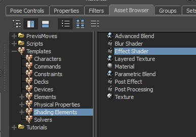
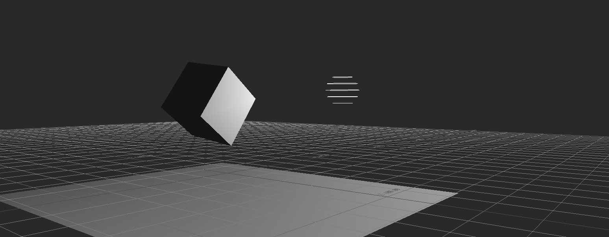
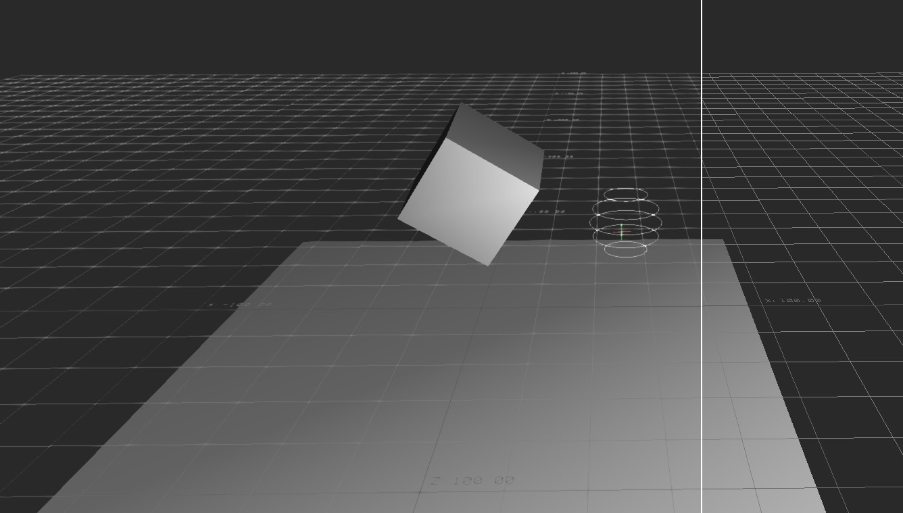
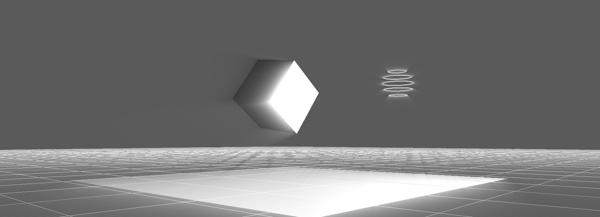
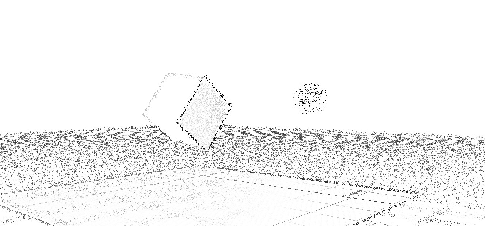
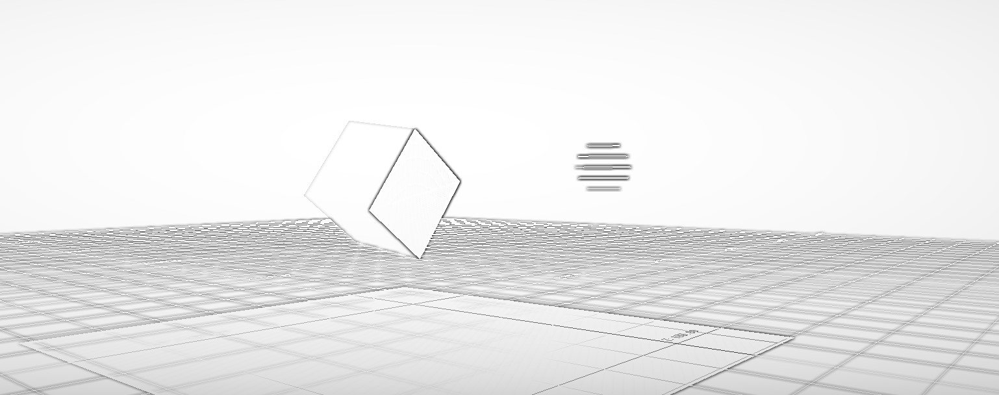

# Custom Effect


Work in progress, the feature is not part of main branch!


Custom effect gives you a way to make a new effect for the post processing system. The effect is based on fragment glsl shaders.


There is a big collection of shader examples at [shadertoy](https://shadertoy.com/) resource

Below you can find a topic on how to adapt a shadertoy shader



New assets

* Post Effect&#x20;
* Effect Shader
* list of pre-defined effect shaders like Blur shader

<figure><figcaption></figcaption></figure>


### Examples

You can find example scenes in the openmobu repositiory / MB\_Scenes folder

<figure><figcaption><p>original scene without post processing</p></figcaption></figure>

<div><figure><figcaption><p>fxaa effect</p></figcaption></figure> <figure><figcaption><p>god rays effect</p></figcaption></figure> <figure><figcaption><p>sketchy effect</p></figcaption></figure> <figure><figcaption><p>sketchy effect 2</p></figcaption></figure></div>


### System Uniforms

| name               | declaration                           | description                                                                                                                                                                                                                                                  |
| ------------------ | ------------------------------------- | ------------------------------------------------------------------------------------------------------------------------------------------------------------------------------------------------------------------------------------------------------------ |
| inputSampler       | uniform sampler2D inputSampler;       | this is an input image from the processing chain. The image of all previous applied effects during frame render.                                                                                                                                             |
| iChannel0          |                                       | same as inputSampler                                                                                                                                                                                                                                         |
| depthSampler       | uniform sampler2D depthSampler;       | this is a scene depth texture sampler, based on scene raw depth information                                                                                                                                                                                  |
| linearDepthSampler | uniform sampler2D linearDepthSampler; | a depth texture converted into a linear space [https://web.archive.org/web/20130416194336/http://olivers.posterous.com/linear-depth-in-glsl-for-real](https://web.archive.org/web/20130416194336/http://olivers.posterous.com/linear-depth-in-glsl-for-real) |
| maskSampler        | uniform sampler2D maskSampler;        | binded mask texture for a shader processing. mask is defined per post processing object                                                                                                                                                                      |
| normalSampler      | uniform sampler2D normalSampler;      | not supported yet                                                                                                                                                                                                                                            |
| useMasking         | uniform float useMasking;             | float uniform \[0; 1] to define if the mask have to be used                                                                                                                                                                                                  |
| upperClip          | uniform float upperClip;              | this is an upper clip image level. defined in a texture coord space to skip processing                                                                                                                                                                       |
| lowerClip          | uniform float lowerClip;              | this is a lower clip image level. defined in a texture coord space to skip processing                                                                                                                                                                        |
| gResolution        | uniform vec2 gResolution;             | vec2 that contains processing absolute resolution, like 1920x1080                                                                                                                                                                                            |
| iResolution        |                                       | same as gResolution                                                                                                                                                                                                                                          |
| texelSize          | uniform vec2 texelSize;               | vec2 of a texel size, computed as 1/resolution                                                                                                                                                                                                               |
| iTime              | uniform float iTime;                  | compatible with shadertoy, float, shader playback time (in seconds)                                                                                                                                                                                          |
| iDate              | uniform vec4 iDate;                   | compatible with shadertoy, vec4, (year, month, day, time in seconds)                                                                                                                                                                                         |
| cameraPosition     | uniform vec3 cameraPosition;          | current camera position in world space                                                                                                                                                                                                                       |
| modelView          | uniform mat4 modelView;               | current camera modelview matrix                                                                                                                                                                                                                              |
| projection         | uniform mat4 projection;              | current camera projection matrix                                                                                                                                                                                                                             |
| modelViewProj      | uniform mat4 modelViewProj;           | current camera modelview-projection matrix                                                                                                                                                                                                                   |


### Uniform Special Postfix

During compilation the shader effect is going to pick the system uniforms and user uniforms. For user uniforms is going to make object properties, so that user could customize the input values for the shader render.

There is a way to customize the ui elements based on a given special postfix to a uniform name

| Uniform type | Postfix  | Description                                                                                      |
| ------------ | -------- | ------------------------------------------------------------------------------------------------ |
| float        | \_slider | make a UI with clamped range \[0; 100] and convert it into \[0; 1] as output                     |
| float        | \_flag   | make a checkbox and cast the on/off flag to a float \[0; 1]                                      |
| vec2         | \_wstoss | make a vector3 ui element and convert value from a world space into vec2 uniform in screen space |
| vec3         | \_color  | make a color RGB picker and output as vec3                                                       |
| vec4         | \_color  | make a color RGBA picker and output as vec4                                                      |


### Shadertoy shaders and adaptation for a custom effect

First of all, we have to add a header information about shader version and input, output values. In our case the input value is vec2 TexCoord which represents a processed texel position in uv space \[0; 1] and output is vec4 FragColor which is our computed texel color.

```
#version 140

in vec2 TexCoord;
out vec4 FragColor;
```

The main entry function have to be renamed from&#x20;

```
void mainImage( out vec4 fragColor, in vec2 fragCoord )
```

into

```
void main(void)
```

The output variable to store a texel color is called FragColor with capital letter while shadertoy shader has fragColor with a lower case.

The input TexCoord is in uv space, while shadertoy shader operates with fragCoord in image space. In order to convert from uv space into image space, we have to multiply our tex coord by image resolution.

```
vec2 fragCoord = TexCoord * iResolution.xy;
```

where iResolution is system uniform that have to be defined in the top of the shader

```
uniform vec2 iResolution;
```

For shaders that require buffers, you need to create each buffer as a separate GLSL fragment shader and use them to compose an effect shader. Then, connect these shaders together in the execution chain. When you have a `sampler2D` uniform, it will be exposed as a list object property in MotionBuilder, allowing another shader to be used to compute that input.


