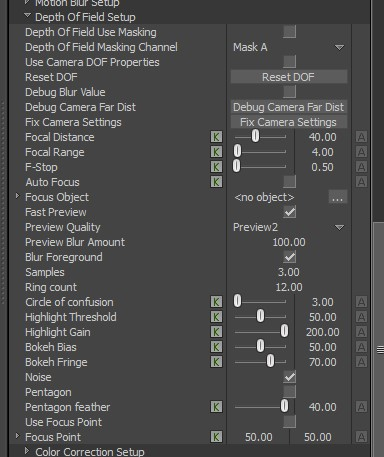

# Depth of Field Effect

The DOF effect simulates camera focus by blurring pixels based on their distance from the focal plane.

<figure><figcaption>
A scene without DOF effect
</figcaption></figure>

<figure><figcaption>
Applied DOF effect
</figcaption></figure>

<figure><figcaption>
Debug visualization of calculated blur amount
</figcaption></figure>

This is a standard effect and its properties you can find in the post processing user object

<figure><figcaption></figcaption></figure>

&#x20;

#### Focus Control

You can control the focal plane in several ways:

* **Manual Focal Distance**\
  You can explicitly set the _Focal Distance_, which defines the distance (in scene units) at which objects appear sharp.
* **Focus Object / Autofocus**\
  If a _Focus Object_ is assigned and Auto Focus option is enabled, the focal distance is automatically computed from the camera to that object.
* **Camera DOF Properties**\
  When **Use Camera DOF Properties** is enabled, the effect uses the camera’s real-time DOF settings:
  * _Focal Distance_ is derived from the camera focus system (including Interest or Focus Model).
  * _Focal Range_ is taken from the camera and acts as a focus softness / in-focus band width.

#### Blur Behaviour

* Pixels at the focal distance remain sharp.
* Blur increases progressively for pixels in front of and behind the focal plane.
* The blur falloff is stable and distance-based (linear depth), ensuring predictable behaviour across the scene.
* **Foreground Blur Toggle**\
  You can disable foreground blur (objects closer than the focal plane) if needed.

#### Optical Controls

Although the effect is artist-friendly and not strictly physically-based, it incorporates familiar lens parameters:

* **F-Stop (`fstop`)**\
  Controls overall blur strength:
  * Lower values → stronger blur (shallower depth of field)
  * Higher values → weaker blur
* **Circle of Confusion (`CoC`)**\
  Scales blur intensity:
  * Larger values → stronger and wider blur
  * Smaller values → tighter focus
* **Focal Range**\
  Defines the size of the in-focus region around the focal distance:
  * Larger values → wider sharp region
  * Smaller values → shallower depth of field

#### Bokeh and Sampling

* The blur is computed using a multi-ring sampling kernel.
* **Samples** and **Rings** control quality:
  * Increasing both improves smoothness and reduces artifacts
  * Higher values increase GPU cost

Recommended starting point:

* `Samples ≥ 4`
* `Rings ≥ 4`&#x20;

#### Bokeh Shape (Pentagon)

* Optional pentagonal aperture simulation is supported.
* When enabled:
  * The sampling kernel is shaped using an aperture mask
  * This affects how highlights are blurred (bokeh shape)

Notes:

* The effect is most visible on:
  * bright highlights
  * emissive objects
  * specular reflections
* Subtle on flat or low-contrast surfaces

#### Debug Options

* **Debug Blur Value**\
  Displays the computed blur factor as grayscale.
* **Focus Visualization (optional)**\
  Can highlight focal plane and transition zones.
