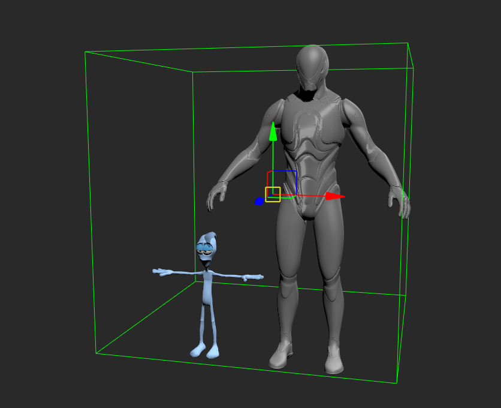

# Super Dynamic Lighting Shader

This is an advanced version of the Dynamic Lighting Shader.

Additional features:

* Supported Texture channels and their transformations: diffuse, transparency, specular, reflection, displacement, and normal map
* Support for shadow maps from infinite and spot affected lights
* Selection of Lambert or Oren-Nayar shading for diffuse
* Options for specular reflectivity: Phong, Anisotropic and Cook Torrance
* Rim lighting
* Vertex displacement
* Reflection spherical texturing
* Support for a second UV set with assigned LightMap textures per model
* MatCap diffuse shading
* Support for global ambient and fog settings


To get access to a wider list of texture channels, you have to put checkbox "Advanced Mode" in the material layout


The shader is taking in a count texture transformation as well for channels: diffuse, transparency, displacement, specular, reflect and normal map.

<figure><figcaption>
Texture transformation in a texture layout
</figcaption></figure>

### Shading

Supported diffuse shading. The selection is defined by a material custom property (see a correspondent documentation section)

* Lambert
* Oren-Nayar (more diffused light destribution, better fit for a character skin surface)

Supported specular reflections. The selection is defined by a material custom property (see a correspondent documentation section)

* Phong
*   Anisotropic

    <figure><figcaption>
anisotropic specular reflection
</figcaption></figure>
*   Cook Torrance (with a given specular map where R channel describes the roughness, it's a good fit for a skin surface specular reflections)&#x20;

    <figure><figcaption></figcaption></figure>

### Shadows

Shadows are implemented as projected textured shadow maps. Shadows will be rendered only from infinite and spot lights which are defined in Affected Lights properties of the shader.

Shadows will be rendered only for models defined in the Casters property list of a shader.


Defined list of affected lights and list of caster models is a requirement for shadows


Super dynamic lighting has support for unlimited number of lights (depends on your hardware capabilities, I would recommend to avoid having more than 32). The same for shadow mapping, it goes as a texture array and will try to allocate and render as many shadows as it was required.

<figure><figcaption></figcaption></figure>

On a shader side we have parameters

* **Shadows** - to toggle shadow mapping for the shader instance
* **Shadow Size** - by default 2k, the size of shadow textures (better to use a size of a power of two like 1024, 2048, 4096)
* **Offset Factor** - offset to a polygon in a current view based on its slope
* **Offset Units** - global const offset in depth units

Each light has "**cast shadows**" flag to toggle shadow casting individually.

Each model has flags for **Casts Shadows** and **Receive Shadows** which are connected to a correspondent logic inside the shader.

### Infinite light shadow map

Infinite light shadow uses the whole scene bounding box as a default frustum area to render into a shadow map. With a big complex scene that could lead to a shadow quality degradation.&#x20;

There is a way to define a custom bounding box for a shadow rendering. To do so you have to define an object or set of objects which bounding box you would like to use.

<figure><figcaption>
example of infinite light shadow bounding box
</figcaption></figure>

Then attach these objects into a "Shadow Bounding Box" custom light property

<figure><figcaption>
custom object property and defined model to be used as bounding box area for shadow
</figcaption></figure>

### Custom Properties

#### Scene material properties

* **Diffuse Type** where 0 - Lambert, and 1 - Oren-Nayar
* **Specular Type** where 0 - Phong, 1 - Anisotropic and 2 - Cook Torrance
* **RoughnessX** and **RoughnessY** - properties or specular distribution for the anisotropic specular

<figure><figcaption></figcaption></figure>

#### Scene light properties

* **Magnitude** - Number, defines the light influence radius
* **Cast Specular On Object** - bool, defines either light have to contribute to a specular term

<figure><figcaption></figcaption></figure>

#### Script to automate properties creation

There is a script ScriptCreateLightAndMaterialProperties.py in OpenMobu/PythonScripts/Actions/SuperDynamicLightingShader

The script will help to create needed custom properties for selected light or material models.

### Transparency

When shader transparency is defined, then blend mode based on alpha channel source is enabled in opengl

In additional shader could do a fragment discard on alpha less than 0.5. That could be useful for a depth information masking for ambient occlusion.

### Global Ambient and Fog

Material ambient color is used in combination with a defined global ambient color. In case you have black global ambient color, there will be no effect from the material ambient

<figure><figcaption></figcaption></figure>

Fog in global light settings also has an influence on the shading, so you can use it with Super Dynamic Lighting shader.

## How to use second UV set and baked shadows

[Video on Youtube](https://youtu.be/ILbo5VWHVTE?si=0_cpQJcIU0AALap6)

## What is MatCap

**MatCap** (short for **"Material Capture"**) is a shading technique commonly used in 3D rendering to create fast and visually appealing materials by mapping lighting and material properties directly from a texture.

In order to use MatCap shading you have to import such matcap image and assign it as input for MatCap texture in the shader properties. Plus you have to put "Use MatCap" property to true.

<figure><figcaption></figcaption></figure>

<figure><figcaption>
example on how matcap texture looks like
</figcaption></figure>

<figure><figcaption></figcaption></figure>

## Where to get matcap images ?

[Here is a huge collection of matcaps on github repository](https://github.com/nidorx/matcaps)
